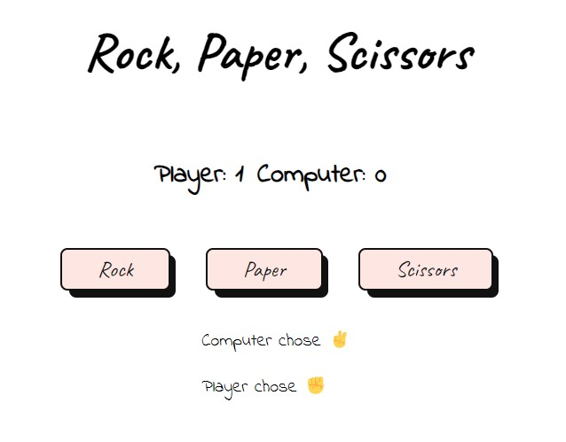

# Introduction
The objective is to use Javascript to make a simple implementation of rock paper scissors game. For each game, player(user) will play against the computer for 5 rounds. The score for the player and computer will be displayed after each round along with the selection of the player and randomely chosen computer selection. The scores reset after 5 rounds of a game. This is my second project using Javascript.

[👉Live Demo](https://bravoosonja.github.io/rockpaperscissors/)


# Skills used
- HTML
- CSS
- Javascript
# Lessons learned
- Implementation of Javascript event listeners to handle click for buttons
- Implementation of swith statement to display selection
- The scores would not update on the first implementation but I was able to resolve this by adding ```function updateScore()```to take the round result from ```function playRound()```then to ```function isGameOver()```to display the game result
# Future plans
- [ ] Update the scores so that they display up to 5 points. Currently, the scores only display upto either player or computer reaches 4 points even though the game result displays the winner of the game after 5 rounds.
- [ ] Update Readme   
